# Ansible

This article covers integral tools for systems engineers, DevOps engineers and cloud engineers on how to automate repetitive tasks throughout an entire IT infrastructure.

## Table of Contents
- What is Ansible?
- Why should I use Ansible?
- Installing Ansible
- Configuring Inventory in Ansible
- Demo: Ansible Inventory
- What is YAML?
- Ansible Playbook
- Demo: Ansible Playbook
    - Executing Ansible using the ansible command
    - Executing Ansible using the ansible-playbook command
- Ansible Modules
    - command module
    - script module
    - service module
    - Demo: Ansible Modules
- Ansible Variables


## What is Ansible?
Ansible is a tool that generates written instructions for automating IT professionals' work throughout the entire system infrastructure.

## Why should I use Ansible?


## Installing Ansible
For the purpose of this article, I would be using CentOS 7.0 on an AWS EC2 instance.

- create your EC2 instance with centos as the operating system and ssh into it.
    ```
    ssh -i <key_name>.pem centos@<instance_ip>
    ```
    Results:
    

While trying to install ansible, you might get the following error as I did: In that case, what you should do is to install the following packages:
```
sudo yum install epel-release
```
Results:
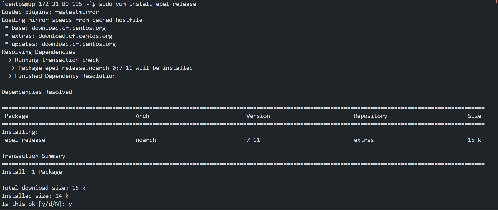

As in the course of my research to fix the error that ansible is a part of the Extra Packages for Enterprise Linux(EPEL), which is why you have to install epel-release.

- install ansible
    ```
    sudo yum install ansible
    ```
    Results:
    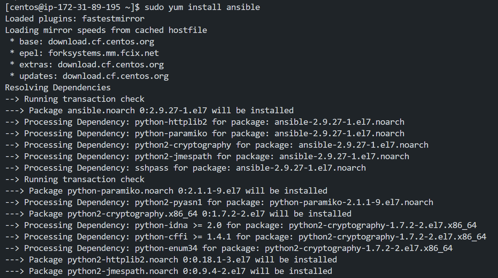

- You can confirm that ansible is installed by running the following command:
    ```
    ansible --version
    ```
    Results:
    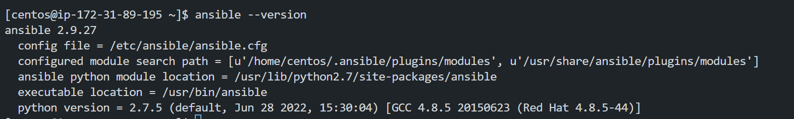
Now Ansible is properly installed and we can then move on to the next step.

## Configuring Inventory in Ansible
Ansible can work with 2 or more servers in your infrastructure to work with these servers. Ansible must establish connectivity with them. This connectivity is established using ssh for Linux and PowerShell remoting for windows. This particular feature is what makes ansible agentless (you don't need to install additional software on the target machines for it to be able to work with ansible).
Information about these target systems is stored in an inventory file.
If you don't create an inventory file, ansible will use the default inventory file that is located at /etc/ansible/hosts.


Take a look at a sample inventory file:
```
server1.company.com
server2.company.com

[group1] # This is a group of servers
server3.company.com
server4.company.com
```
Note: We can have multiple groups in an inventory file.

- Working with aliases on server names in inventory files:
```
web ansible_host=server1.company.com
db ansible_host=server2.company.com
```
Note: We can have multiple aliases on server names in the inventory file.

The inventory file also determines the following parameters:
- The connection type (ssh or winrm)
- The username to use for the connection(root/administrator)
- The password to use for the connection
- The port to use for the connection(22 for ssh and 5986 for winrm)

For example, we could have
```
web ansible_host=server1.company.com ansible_connection=ssh ansible_user=root ansible_ssh_pass=password ansible_port=22
db ansible_host=server2.company.com ansible_connection=winrm ansible_user=administrator ansible_password=password ansible_port=5986
```
Note: Setting key-based passwords in plaintext format is not ideal for security reasons. You should set up ssh-key based passwordless authentication for the servers.

## Demo: Ansible Inventory
Here we would work on creating an inventory file.

- Create a new directory called test-project and cd into it.
    ```
    mkdir test-project
    cd test-project
    ```
    Results:
    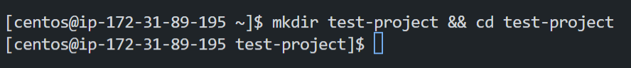

- Then in the test project create an inventory file.
    ```
    cat > inventory.txt
    ```
    and add the following, which is the address of a server in our infrastructure:
    ```
    # Sample Inventory File

    # Web Servers
    web_node1 ansible_host=web01.xyz.com ansible_connection=winrm ansible_user=administrator ansible_password=Win$Pass
    web_node2 ansible_host=web02.xyz.com ansible_connection=winrm ansible_user=administrator ansible_password=Win$Pass
    web_node3 ansible_host=web03.xyz.com ansible_connection=winrm ansible_user=administrator ansible_password=Win$Pass

    # DB Servers
    sql_db1 ansible_host=sql01.xyz.com ansible_connection=ssh ansible_user=root ansible_ssh_pass=Lin$Pass
    sql_db2 ansible_host=sql02.xyz.com ansible_connection=ssh ansible_user=root ansible_ssh_pass=Lin$Pass

    # Groups
    [db_nodes]
    sql_db1
    sql_db2

    [web_nodes]
    web_node1
    web_node2
    web_node3

    [boston_nodes]
    sql_db1
    web_node1

    [dallas_nodes]
    sql_db2
    web_node2
    web_node3

    [us_nodes:children]
    boston_nodes
    dallas_nodes
    ```
    Results:
    

- Then let's test our connection to the server
    ```
    ansible target1 -m ping -i inventory.txt
    ```
    Results:
    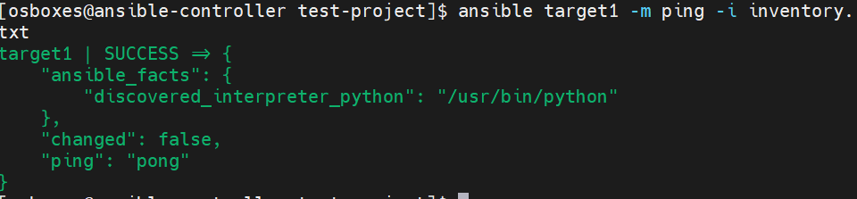

## What is YAML?
A YAML file is a human-readable file that is used to store data, mostly configuration data. It works like a key-value pair file. The key is the name of the data and the value is the data itself. Data can also be stored in a list or as an array. Yaml files can also contain dictionaries.
Note: In writing YAML files you must have an equal number of spaces.


## Ansible Playbook
Ansible Playbook is a YAML file that is used to run ansible commands on a target system. It is a collection of tasks that are executed in order, from executing VMS on the public cloud to installing software on a server and many other tasks.

- A playbook file consists of a play and a series of tasks. 

- A play is a collection of tasks that are executed in order.
- A Task is an action to be performed on the target system.

- A play in plaintext is a list of dictionaries with properties such as names, hosts, and tasks. 

After creating your playbook you can run it by running the following command:
```
ansible-playbook playbook.yml
```
where playbook.yml is the name of the playbook file.

## Demo: Ansible Playbook
Here we would work on creating a playbook file.
Note: There are two ways of running ansible. The first is to run the command directly using ansible and the second is to use the ansible-playbook command.

### Executing ansible using the ansible command
-Create a new directory called project-1 and cd into it.
    ```
    mkdir project-1
    cd project-1
    ```
    and in project one create an inventory.txt file as shown below:

    ```
        # Sample Inventory File
        target1 ansible_host=<target-ip-address> ansible_ssh_pass=<target-password>
        target2 ansible_host=<target-ip-address> ansible_ssh_pass=<target-password>
        
    ```
    

- Ansible has a default group called 'all' and every host in the inventory file is a member of this group.
    ```
    ansible all -m ping -i inventory.txt
    ```
    The format for running an ansible command is as follows:
    ```
    ansible [group/host] -m <module>-i <inventory>
    ```
    Results:
    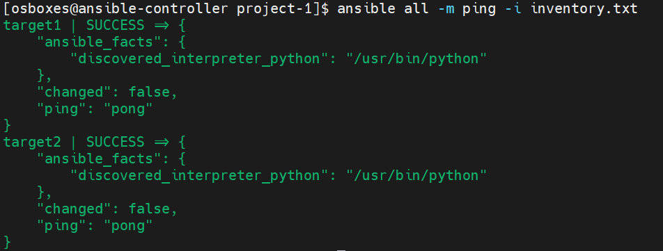

### Executing ansible using the ansible-playbook command
In this case, we will use the ansible-playbook command to run the playbook. But before we run this command we need to create an ansible playbook file.

- In the project 1 folder create a playbook file <playbook-pingtest.yaml>
    ```
    cat > playbook-pingtest.yaml
    ```
    and add the following, which is the address of a server in our infrastructure:
    ```
    - 
        name: Test Connectivity to target servers
        hosts: all
        tasks:
        - name: Ping Test
            ping:
    ```
    Results:
    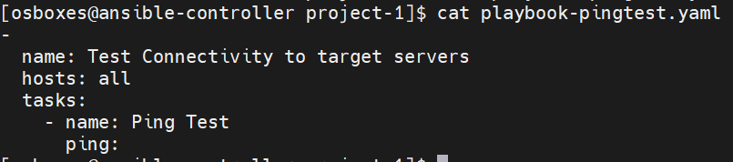

- To execute the playbook we use the command
    ```
    ansible-playbook playbook-pingtest.yaml -i inventory.txt
    ```
    Results:
    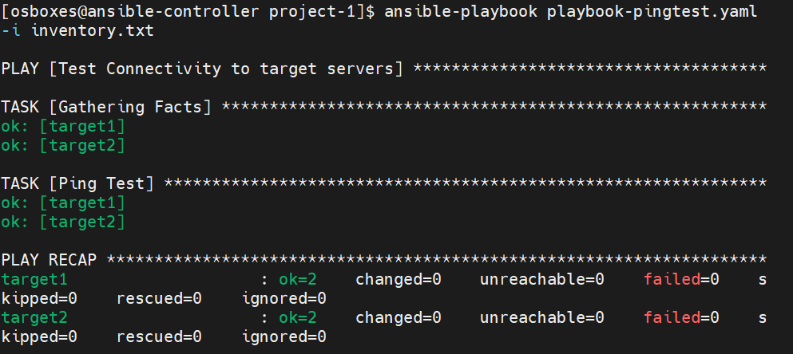


### Copying files to target hosts
In this case, we will use the ansible-playbook command to run the playbook that copies a file to the target host.
- Create a sample file 
    ```
    cat > /tmp/test-file.txt
    ```
    and in the file just put a sample text
    ```
    This is just a sample test file using ansible playbook to copy files from the controller to target hosts.
    ```
    Results:
    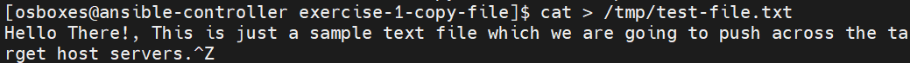

- Then we create a playbook <playbook-copy-file.yaml> and enter the following code
    ```
    -
        name: Copy file to target servers
        hosts: all
        tasks:
            - name: Copy file
            copy:
                src: /tmp/test-file.txt
                dest: /tmp/test-file.txt

    ```
    Note: The module used here is the copy module and which we specified the location of the file to be copied, which is the src property. And the destination to copy the file which is the "dest" property.

    And then we run the playbook with the command below:
    ```
    ansible-playbook playbook-copy-file.yaml -i inventory.txt
    ```
    Results:
    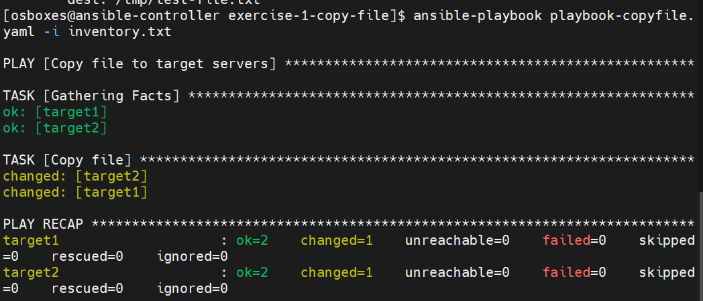

- Now if you check the target servers to search for the file we copied using the command
    ```
    cat /tmp/test-file.txt
    ```
    Results:
    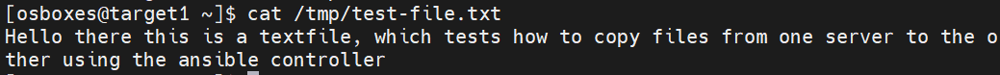

## Ansible Modules

Ansible modules are used to perform actions on the target system. They are categorized into various groups based on their functionality.

- System Modules: These are actions that are performed at the system level.
- Command Modules: These are used to execute scripts or commands on a host.
- File Modules: These are used to work on files on hosts.
- Database Modules: These are used to work on databases such as MongoDB, MySQL, PostgreSQL, etc. They are used to add or remove databases or modify DB configuration.
- Cloud Modules: This contains a vast collection of modules that are used to work with different cloud providers.
- Windows Module: This is used to work with windows environments.
- And many more.

### The command module
The command module is used to execute commands on a remote node.

?????
Would talk about the parameters in the command module.


?????


### The script module
The script module executes a script located on the ansible controller machine after transferring it over to the target hosts.

### The service module
The service module is used to maintain services on nodes on the network, it is used to start, stop, restart, or check the status of a service on a remote node.


### Demo: Ansible Modules
The following example shows how to execute a script on a series of web server nodes and also how to start the httpd service on the web server nodes.

```
-
    name: 'Execute a script on all web server nodes'
    hosts: web_nodes
    tasks:
        -
            name: 'Update entry into /etc/resolv.conf'
            lineinfile:
                path: /etc/resolv.conf
                line: 'nameserver 10.1.250.10'
        -
            name: 'Create a new user'
            user:
                name: web_user
                uid: 1040
                group: developers
        -
            name: 'Execute a script on all web server nodes'
            script: /tmp/install_script.sh
        -
            name: 'Start httpd services on all web server nodes'
            service: 
                name: httpd
                state: started
```

## Ansible Variables
A variable stores information that can vary with each host. Variable can be defined in the playbook file or in the inventory file or in a separate variable file.
The variable is defined in the playbook file and is passed to the module as an argument.
To use a variable in a module, you need to use the following syntax:

```
{{ var_name }}
```


## Ansible Conditionals
Conditionals are used when you need to perform an operation on different server types that require the use of different commands to carry out the same task.


## Loops


## Ansible Roles
The primary purpose of roles is to make ones work reusable, as it involves writing a set of tasks that would be done repetitively so that other can also be able to make use of these tasks.
For example, if you have a web server that needs to be installed on all the nodes in your infrastructure, you can create a role that contains the tasks to install the web server on all the nodes.