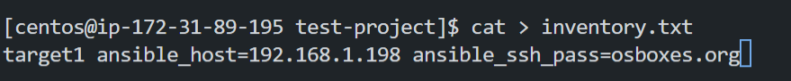

This article covers an integral tools for systems engineers, devops engineers and cloud engineers on how to automate repetitive tasks through out an entire IT infrastructure.

## Table of Contents
- What is Ansible?
- Why should I use Ansible?
- Installing Ansible
- Configuring Inventory in Ansible
- Demo: Ansible Inventory
- What is yaml?
- Ansible Playbook


## What is Ansible?
Ansible is a tool that generates written instructions for automating IT professionals' work throughout the entire system infrastructure.

## Why should I use Ansible?


## Installing Ansible
For the purpose of this article, I would be using CentOS 7.0 on an AWS EC2 instance.

- create your EC2 instance with centos as the operating system and ssh into it.
    ```
    ssh -i <key_name>.pem centos@<instance_ip>
    ```
    Results:
    

While trying to install ansible, you might get the following error like I did:
```
[centos@ip-172-31-89-195 ~]$ sudo yum install ansible
Loaded plugins: fastestmirror
Loading mirror speeds from cached hostfile
 * base: download.cf.centos.org
 * extras: download.cf.centos.org
 * updates: download.cf.centos.org        
No package ansible available.
```
In that case what you should do is to install the following packages:
```
sudo yum install epel-release
```
Results:


As in the course of my research to fix the error that ansible is a part of the Extra Packages for Enterprise Linux(EPEL), which is why you have to install epel-release.

- install ansible
    ```
    sudo yum install ansible
    ```
    Results:
    

- You can confirm that ansible is installed by running the following command:
    ```
    ansible --version
    ```
    Results:
    
Now Ansible is properly installed and we can then move on to the next step.

## Configuring Inventory in Ansible
Ansible can work with 2 or more server in your infrastructure in order to work with these servers. Ansible must establish connectivity with them. This connectivity is established using ssh for linux and powershell remoting for windows. This particular feature is what makes ansible agentless (you don't need to install additional software on the target machines for it to be able to work with ansible).
Information about these target systems is stored in an inventory file.
If you don't create an inventory file, ansible will use the default inventory file that is located at /etc/ansible/hosts.

- Taking a look at a sample inventory file:
```
server1.company.com
server2.company.com

[group1] # This is a group of servers
server3.company.com
server4.company.com
```
Note: We can have multiple groups in an inventory file.

- Working with aliases on server names in inventory file:
```
web ansible_host=server1.company.com
db ansible_host=server2.company.com
```
Note: We can have multiple aliases on server names in inventory file.

The inventory file also determines the following parameters:
- The connection type (ssh or winrm)
- The username to use for the connection(root/administrator)
- The password to use for the connection
- The port to use for the connection(22 for ssh and 5986 for winrm)

For example we could have
```
web ansible_host=server1.company.com ansible_connection=ssh ansible_user=root ansible_ssh_pass=password ansible_port=22
db ansible_host=server2.company.com ansible_connection=winrm ansible_user=administrator ansible_password=password ansible_port=5986
```
Note: Setting key based passwords in plaintext format is not ideal for security reasons. You should set up ssh-key based passwordless authentication for the servers.

## Demo: Ansible Inventory
Here we would work on creating an inventory file.

- Create a new directory called test-project and cd into it.
    ```
    mkdir test-project
    cd test-project
    ```
    Results:
    

- Then in the test project create an inventory file.
    ```
    cat > inventory.txt
    ```
    and add the following, which is the address of a server in our infrastructure:
    ```
    # Sample Inventory File

    # Web Servers
    web_node1 ansible_host=web01.xyz.com ansible_connection=winrm ansible_user=administrator ansible_password=Win$Pass
    web_node2 ansible_host=web02.xyz.com ansible_connection=winrm ansible_user=administrator ansible_password=Win$Pass
    web_node3 ansible_host=web03.xyz.com ansible_connection=winrm ansible_user=administrator ansible_password=Win$Pass

    # DB Servers
    sql_db1 ansible_host=sql01.xyz.com ansible_connection=ssh ansible_user=root ansible_ssh_pass=Lin$Pass
    sql_db2 ansible_host=sql02.xyz.com ansible_connection=ssh ansible_user=root ansible_ssh_pass=Lin$Pass

    # Groups
    [db_nodes]
    sql_db1
    sql_db2

    [web_nodes]
    web_node1
    web_node2
    web_node3

    [boston_nodes]
    sql_db1
    web_node1

    [dallas_nodes]
    sql_db2
    web_node2
    web_node3

    [us_nodes:children]
    boston_nodes
    dallas_nodes
    ```
    Results:
    

<!-- - Then let's test our connection to the server
    ```
    ansible target1 -m ping -i inventory.txt
    ```
    Results:
     -->

## What is yaml?
A yaml file is a human readable file that is used to store data, mostly configuration data. It works like a key value pair file. The key is the name of the data and the value is the data itself. Data can also be stored in a list or as an array. Yaml files can also contain dictionaries.
Note: In writing yaml files you must have equal number of spaces.


## Ansible Playbook
Ansible Playbook is a yaml file that is used to run ansible commands on a target system. It is a collection of tasks that are executed in order, from executing vms on public cloud to installing software on a server and many other tasks.

- A playbook file consists of a play and a series of tasks. 

- A play is a collection of tasks that are executed in order.
- A Task is an action to be performed on the target system.

- A play in plaintext is a list of dictionaries with properties such name, hosts, tasks. 

After creating your playbook you can run it by running the following command:
```
ansible-playbook playbook.yml
```
where playbook.yml is the name of the playbook file.